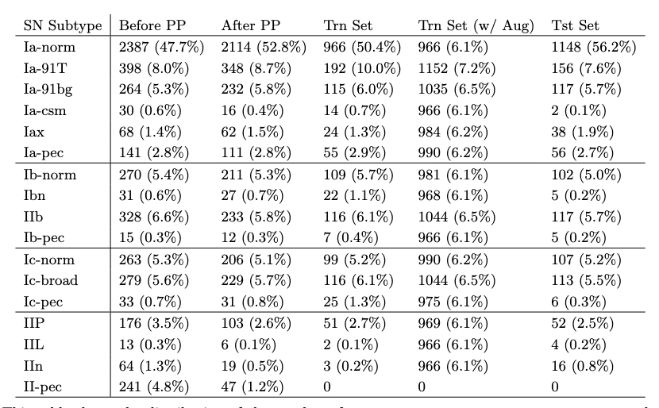
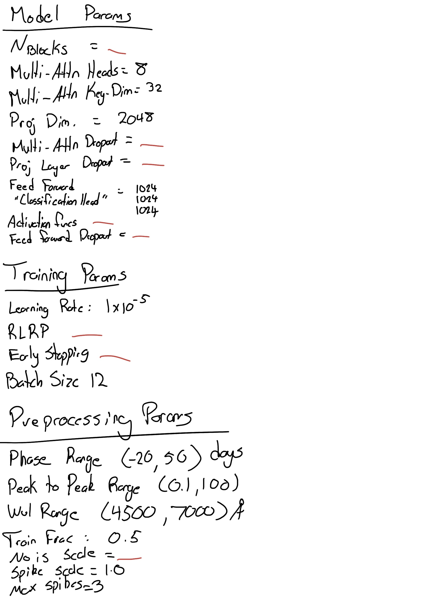
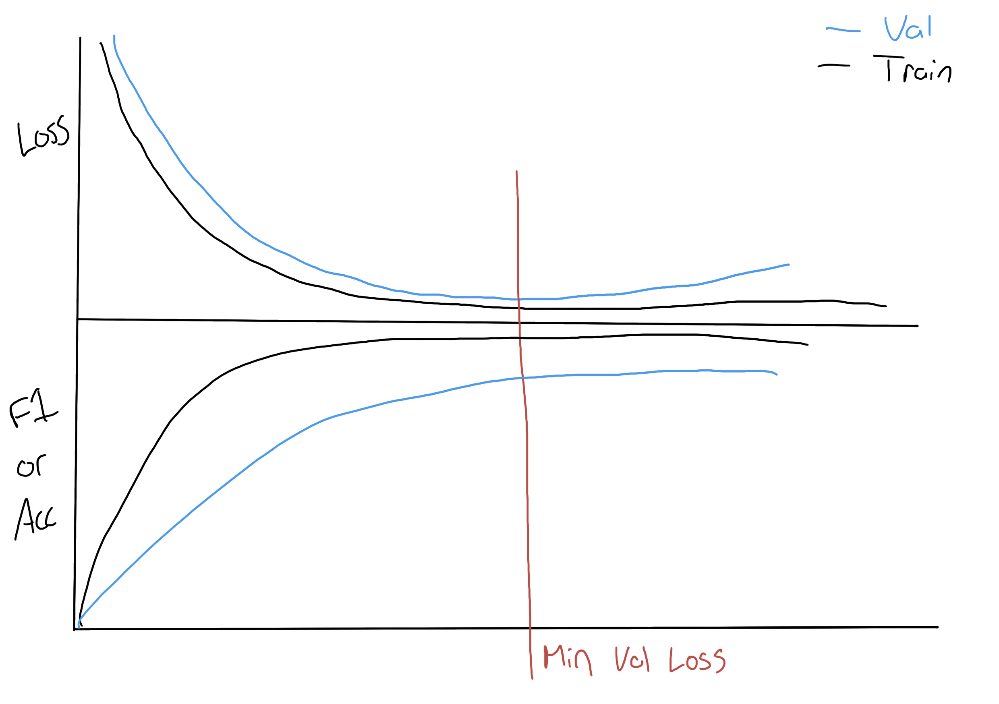

# Attention-Based Supernova Subtype Classification

### Figure 1: Each bar represents the total number of SNe discovered each year since SN1937D, a SN Ia in NGC 1003 (Baade & Zwicky 1938). Note the y-axis is in log-scale. The blue section denotes the SNe without spectral confirmation. The orange section denotes the SNe that were spectroscopically confirmed with one or two spectra. The red section denotes SNe that have been spectroscopically studied over time with more than two spectra. As the discovery rate of SNe grows, the rate of spectral classification of SNe does not keep up. The LSST will cause an unprecedented influx of new SNe that will only add to the stress on existing spectrograph facilities. The lack of spectrally studied SNe in recent years is likely due to publication delay. Data from the Open SN Catalog API gathered on August 4th, 2022 (we note this service is no longer maintained and recent data may be incomplete).

***

### Figure 2 [PLACEHOLDER, remade with the correct SN subtypes and with a better color scheme]: A 'treemap' plot showing the number of spectra in our dataset for each SN type. The area of each rectangle is proportional to the number of spectra. Blue, orange, green and magenta rectangles denote SN spectra with broadtype Ia, Ib, Ic, and II, respectively.

***

### Table 1[PLACEHOLDER, remade with the correct SN subtypes]: This table shows the distribution of the number of supernova spectra, not supernova, across each of 17 supernova types. The first column shows the data distribution of the spectra we collected before any pre-processing. The second column shows the data distribution after the pre-processing steps which remove some known bad spectra and some spectra that are poor SNR. The third and fifth columns shows the distribution of a typical training and testing set split. The fourth column shows the final distribution of the training set after the data augmentation techniques have been applied. Note how now each class is represented approximately evenly. Finally, note that no II-pec spectra make it into the model because we only had one supernova (SN1987A) of that type.

***

### Figure 3 [I would like to remake this with potentially a different supernova but also removing the black line and just overall revisiting this plot since its beena a while since I've : A spectrum from SN1998dt, Type Ib, observed 1.8 days after peak brightness. The blackbody continuum has been removed. Type Ib SNe do not show hydrogen spectral lines nor the Siii line at 6355A that characterizes SNe Ia. (Top) The spectrum is plotted at the original high-resolution of R = 738. (Middle) The spectrum is plotted at the low-resolution of R = 100, the same resolution that the SEDM operates at. (Bottom) The spectrum is plotted at the ultra low-resolution of R = 24.

***

### Figure 4: A figure that visualizes the architecture of the model that we are proposing. The image should show any higher-dim embedding step as well as 

***

### Table 2: Hyperparameters for the model, the training, and the preprocessing steps

***

### Figure 5: Transformer and DASH training/validation loss curves at R = 100.

***

### Figure 6+: Confusion Matrices for the various models
