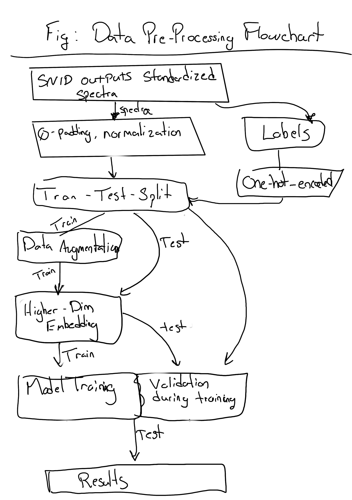

# Attention-Based Supernova Subtype Classification

### Figure 1: Each bar represents the total number of SNe discovered each year since SN1937D, a SN Ia in NGC 1003 (Baade & Zwicky 1938). Note the y-axis is in log-scale. The blue section denotes the SNe without spectral confirmation. The orange section denotes the SNe that were spectroscopically confirmed with one or two spectra. The red section denotes SNe that have been spectroscopically studied over time with more than two spectra. As the discovery rate of SNe grows, the rate of spectral classification of SNe does not keep up. The LSST will cause an unprecedented influx of new SNe that will only add to the stress on existing spectrograph facilities. The lack of spectrally studied SNe in recent years is likely due to publication delay. Data from the Open SN Catalog API gathered on August 4th, 2022 (we note this service is no longer maintained and recent data may be incomplete).

I don't actually know if this is the right thing to have as the first figure.
***

Figure 2: A 'treemap' plot showing the number of spectra in our dataset for each SN type. The area of each rectangle is proportional to the number of spectra. Blue, orange, green and magenta rectangles denote SN spectra with broadtype Ia, Ib, Ic, and II, respectively.

Placeholder: This needs to be remade reflecting the new correct set of SN subtypes. Additionally, I want better colors and overall I want the labels tidier, maybe better font choice.
***

Table 1: This table shows the distribution of the number of supernova spectra, not supernova, across each of 17 supernova types. The first column shows the data distribution of the spectra we collected before any pre-processing. The second column shows the data distribution after the pre-processing steps which remove some known bad spectra and some spectra that are poor SNR. The third and fifth columns shows the distribution of a typical training and testing set split. The fourth column shows the final distribution of the training set after the data augmentation techniques have been applied. Note how now each class is represented approximately evenly. Finally, note that no II-pec spectra make it into the model because we only had one supernova (SN1987A) of that type.

Placeholder: This needs to be remade with the correct set of SN subtypes.
***

Figure 3: A spectrum from SN1998dt, Type Ib, observed 1.8 days after peak brightness. The blackbody continuum has been removed. Type Ib SNe do not show hydrogen spectral lines nor the Siii line at 6355A that characterizes SNe Ia. (Top) The spectrum is plotted at the original high-resolution of R = 738. (Middle) The spectrum is plotted at the low-resolution of R = 100, the same resolution that the SEDM operates at. (Bottom) The spectrum is plotted at the ultra low-resolution of R = 24.

Placeholder: I want to remove the black line at least in the bottom panel, maybe in all three panels. Additionally, we could choose a different supernova.
***

Figure 4: Flowchart showing all of what happens to our data starting when we get it from SNID. SNID outputs standardized spectra (see the SNID paper for their preprocessing steps) and also it provides a label for the supernova. We take all of the spectra and degrade them to our desired spectral resolution (see a section of this paper explaining why we do that). Next, set all flux values outside of the wavelength range 4500 to 7000 angstroms to zero and we normalize each spectra to mean zero and std 1. We perform a special train-test split which ensures no cross contamination between the training and testing sets (see a section of this paper that explains it in detail). The training set is augmented (see the data augmentation section). The training and testing sets MAY be projected into a higher dimension (see the section on transformers/attention mechanisms on why we do that). Next the NN is trained, using the testing set as the validation set during training (see some section of the paper to explain why we have to do this, becauses there isnt enough data to make a train-test-validation splits.) Finally, results and performance is calculated.
***

Figure 5: A figure that visualizes the architecture of the model that we are proposing. This architecture should show everything from the input of the model, including any positional encoding, following the transformer encoder layers (they should be shown too) and then following that the feed forward classification head.

Placeholder: This figure needs the most work, I will probably have to make it in a special program rather than doing it automatically from some website. Either way, it should include the higher-dim embedding stage (if its in the final model) and it should include the PE (if it's in the final model)
***

Table 2: All hyperparamteres related to the model. Not much to be said here?
***

Figure 6: DASH training with new data and fixed train-test-split. (a) Loss and metrics. (b) Confusion matrix on testing set
***

Figure 7: New model (a) Loss and metrics. (b) Confusion matrix on testing set.
