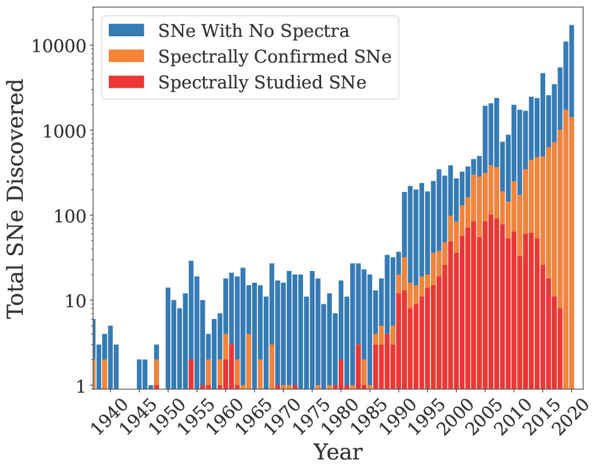

# Paper 1: Minimum Spectroscopic Resolution For Classifying Supernova Subtypes

### Figure 1: Each bar represents the total number of SNe discovered each year since SN1937D, a SN Ia in NGC 1003 (Baade & Zwicky 1938). Note the y-axis is in log-scale. The blue section denotes the SNe without spectral confirmation. The orange section denotes the SNe that were spectroscopically confirmed with one or two spectra. The red section denotes SNe that have been spectroscopically studied over time with more than two spectra. As the discovery rate of SNe grows, the rate of spectral classification of SNe does not keep up. The LSST will cause an unprecedented influx of new SNe that will only add to the stress on existing spectrograph facilities. The lack of spectrally studied SNe in recent years is likely due to publication delay. Data from the Open SN Catalog API gathered on August 4th, 2022 (we note this service is no longer maintained and recent data may be incomplete).

### Figure 2: A 'treemap' plot showing the number of spectra in our dataset for each SN type. The area of each rectangle is proportional to the number of spectra. Blue, orange, green and magenta rectangles denote SN spectra with broadtype Ia, Ib, Ic, and II, respectively.

# Paper 2: Novel Classification Method For Supernova Subtype Classification
