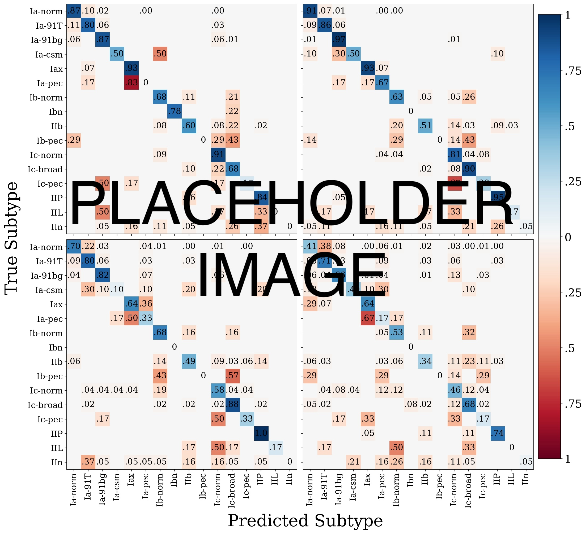

# Paper 1: Minimum Spectroscopic Resolution For Classifying Supernova Subtypes

### Figure 1: Each bar represents the total number of SNe discovered each year since SN1937D, a SN Ia in NGC 1003 (Baade & Zwicky 1938). Note the y-axis is in log-scale. The blue section denotes the SNe without spectral confirmation. The orange section denotes the SNe that were spectroscopically confirmed with one or two spectra. The red section denotes SNe that have been spectroscopically studied over time with more than two spectra. As the discovery rate of SNe grows, the rate of spectral classification of SNe does not keep up. The LSST will cause an unprecedented influx of new SNe that will only add to the stress on existing spectrograph facilities. The lack of spectrally studied SNe in recent years is likely due to publication delay. Data from the Open SN Catalog API gathered on August 4th, 2022 (we note this service is no longer maintained and recent data may be incomplete).

### Figure 2: A 'treemap' plot showing the number of spectra in our dataset for each SN type. The area of each rectangle is proportional to the number of spectra. Blue, orange, green and magenta rectangles denote SN spectra with broadtype Ia, Ib, Ic, and II, respectively.

### Figure 3: A spectrum from SN1998dt, Type Ib, observed 1.8 days after peak brightness. The blackbody continuum has been removed. Type Ib SNe do not show hydrogen spectral lines nor the Siii line at 6355A that characterizes SNe Ia. (Top) The spectrum is plotted at the original high-resolution of R = 738. (Middle) The spectrum is plotted at the low-resolution of R = 100, the same resolution that the SEDM operates at. (Bottom) The spectrum is plotted at the ultra low-resolution of R = 24.

### Figure 4: Four confusion matrices generated from DASH at four different spectral resolutions, R. In each element of each matrix the fraction of objects, corresponding to the class indicated on the x-axis that are classified according to the y-axis, is indicated if it is greater than 0. Incorrect classifications are indicated with shades of red, correct ones with shades of blue. R = 738 (Top Left), full resolution: this represents our benchmark result which replaces the result published in Muthukrishna et al. (2019) due to corrections in the train/test split. R = 100 (Top Right), this is the resolution of the SEDM (Blagorodnova et al. 2018). R = 24 (Bottom Left), is the resolution after which we start noticing a performance degradation in the subtype classification (see Figure 6). R = 10 (Bottom Right), although there is serious loss in classification accuracy, 10 of 16 subtypes still exhibit a classification accuracy greater than chance, ∼ 32.1%. This figure is described in detail in section 4.

### Figure 5: Seven different DASH performances on the testing set are plotted as a function of spectral resolution, R. The horizontal dashed line is the accuracy any model would have if it randomly predicted the subtype of each spectra. The horizontal dot-dashed line is the accuracy any model would have if it randomly predicted the broadtype of each spectra. Taking into account the 80/20 train/test split and the heavy class imbalance, these accuracies are 32.1% and 54.7%, respectively. The dotted line is the macro F1-score DASH achieves when predicting subtype. In a multi-class classification problem, the macro F1-score is the unweighted average of the F1-scores for each class. This unweighted average has the effect of prioritizing all of the classes equally in the metric, which is important for datasets with heavy class imbalance. The solid lines labelled ‘Ia’, ‘Ib’, ‘Ic’, and ‘II’ are the F1-scores (not macro F1-score) for each broadtype, respectively. Uncertainties for each point represent the average value of that metric over the final 1000 iterations during model training. We qualitatively identify R = 25 as the spectral resolution after which model F1-score begins to degrade. This indicates that spectroscopic subtype classification can be done accurately at resolutions lower than that of the SEDM.

### Figure 6: F1-Score vs SNR, 1D plot.

### Figure 7: F1-Score vs SNR and R, 2D plot.

Figures 5, 6 and 7 are all related. Will probably try to combine them into one figure.

# Paper 2: Novel Classification Method For Supernova Subtype Classification

### Figure 1: Each bar represents the total number of SNe discovered each year since SN1937D, a SN Ia in NGC 1003 (Baade & Zwicky 1938). Note the y-axis is in log-scale. The blue section denotes the SNe without spectral confirmation. The orange section denotes the SNe that were spectroscopically confirmed with one or two spectra. The red section denotes SNe that have been spectroscopically studied over time with more than two spectra. As the discovery rate of SNe grows, the rate of spectral classification of SNe does not keep up. The LSST will cause an unprecedented influx of new SNe that will only add to the stress on existing spectrograph facilities. The lack of spectrally studied SNe in recent years is likely due to publication delay. Data from the Open SN Catalog API gathered on August 4th, 2022 (we note this service is no longer maintained and recent data may be incomplete).

### Figure 2: A 'treemap' plot showing the number of spectra in our dataset for each SN type. The area of each rectangle is proportional to the number of spectra. Blue, orange, green and magenta rectangles denote SN spectra with broadtype Ia, Ib, Ic, and II, respectively.

### Table 1 (or maybe a figure: Breakdown of SNe types and how we've grouped them.

### Figure 3: Same as in Paper 1. SN spectra at 3 different resolutions, providing context for why we are doing this entire analysis at R = 100.

### Figure 4: Transformer architecture

### Table 2: Model Parameters

### Figure 5: Transformer and DASH training/validation loss curves at R = 100.

### Figure 6: Transformer CM vs corrected DASH CM at R = 100. All 16 subtypes included

### Figure 7: Transformer CM vs corrected DASH CM at R = 100. Aggregated SN types.
